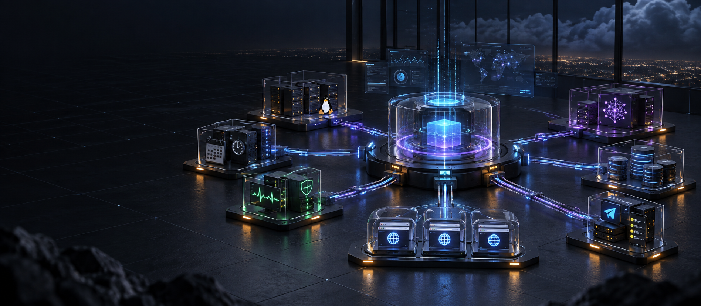
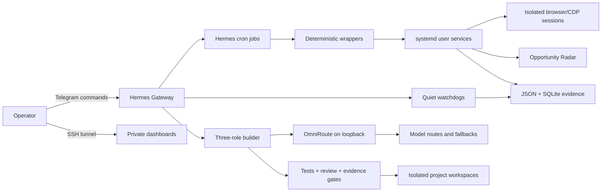
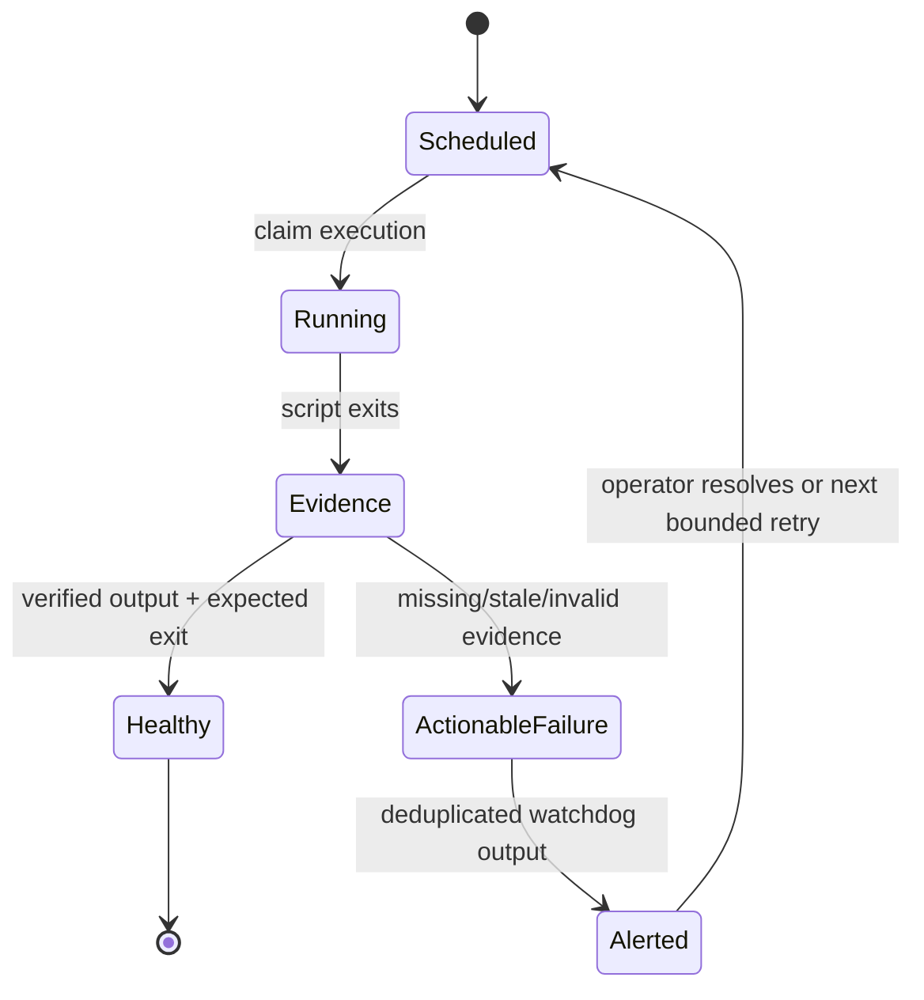

# Hermes VPS Automation Platform




An evidence-driven control plane for running personal automation workloads on a Linux VPS. Hermes Agent provides scheduling and Telegram operations, OmniRoute supplies a local AI routing gateway, systemd owns long-running processes, and deterministic scripts keep browser automation, health checks, reports, and an experimental three-role software builder under explicit safety gates.

This repository is the sanitized, reproducible portfolio edition of a real deployment. It contains no production credentials, cookies, account identifiers, private datasets, or host addresses.

## Why this project exists

Personal automation often starts as a collection of scripts and silently becomes infrastructure. This project makes that infrastructure observable and recoverable:

- schedules are explicit and independently auditable;
- browser sessions are isolated by workload;
- every meaningful run emits JSON or SQLite evidence;
- quiet watchdogs report only actionable failures;
- AI models can propose work, but deterministic code owns state transitions and acceptance;
- private services bind to loopback and are reached through SSH tunnels;
- production state is deliberately separated from public source code.

## Architecture



The production gateway does not expose a public control panel. OmniRoute, dashboards, CDP ports, and noVNC are loopback-only; access is intentionally tunneled.

## What is running

The live audit on **2026-09-25** observed:

| Capability | State | Evidence |
|---|---|---|
| Hermes messaging gateway | Operational | Active since 2026-08-03, zero service restarts |
| OmniRoute model gateway | Operational | Healthy container, six-week uptime, loopback-only |
| Global Builder Radar panel | Operational | Active systemd user service, private HTTP endpoint |
| Wellfound browser stack | Operational | Persistent isolated Chromium/CDP service |
| InfoJobs browser stack | Operational | Isolated Chromium/CDP service; application schedule intentionally paused |
| LinkedIn warm-up | Operational | On-demand browser lifecycle; last scheduler run exited successfully |
| Daily preflight | Operational | 31/31 completed runs in the last 30-day audit window |
| Daily evidence report | Operational | 30/30 completed runs in the last 30-day audit window |
| Autonomous builder V0 | Validated prototype | 15 controller tests passing; final end-to-end validation remains route-dependent |

See the [sanitized live audit](docs/LIVE_AUDIT_2026-09-25.md) and [operational snapshot](screenshots/operational-health.svg).

## Workloads and guardrails

### Opportunity workflows

- **Global Builder Radar** aggregates opportunities and exposes a private HTML dashboard.
- **Wellfound Saved** discovers and saves candidates without applying.
- **Wellfound Apply** runs a separately authorized, bounded application flow.
- **Wellfound Cleaner** removes external-only saved entries and cannot fill or submit forms.
- **InfoJobs** uses weekday query rotation; its application schedule can be paused independently.
- **LinkedIn Warm-up** runs through an on-demand browser, deterministic daily target, weekly rest day, SQLite ledger, JSON report, and a separate health watchdog.

The platform never treats navigation, saving, and submission as the same permission. Each write action requires its own explicit command or deployment flag.

### Autonomous builder V0

The included `hermes_builder` package implements a deterministic three-role loop:

| Role | Primary route | Fallback route | Allowed outcome |
|---|---|---|---|
| Architect | `builder-architect-v0` | configured in OmniRoute | Specifications and acceptance criteria |
| Implementer | `builder-implementer-v0` | configured in OmniRoute | Code and tests inside the isolated workspace |
| Reviewer | `builder-reviewer-v0` | configured in OmniRoute | A machine-readable review decision |

Models do not advance the workflow directly. The controller verifies file boundaries, hashes, test exit codes, findings, iteration limits, and reviewer approval before it can declare completion.

## Reliability model



The distinction between **business outcome** and **process exit code** matters. During the audit, Wellfound Saved confirmed real saves and then returned exit code `1` because no additional candidate passed preflight. Hermes correctly recorded the process failure, but the evidence showed useful work. This known semantic mismatch is documented rather than hidden.

## Repository map

```text
hermes_builder/        Deterministic architect/implementer/reviewer controller
tests/                 Controller, gate, runner, and security tests
ops/scripts/           Sanitized production wrapper and watchdog patterns
deploy/                Example Hermes/OmniRoute profile configuration
skills/                Reusable Hermes autonomous-builder skill
smoke_fixture/         Minimal end-to-end validation input
docs/                  Architecture, operations, security, audit, and decisions
screenshots/           Sanitized operational evidence
assets/                Portfolio artwork
```

## Local validation

The controller has no runtime Python dependencies outside the standard library.

```bash
python -m venv .venv
source .venv/bin/activate
python -m unittest discover -s tests -v
```

On Windows PowerShell:

```powershell
python -m venv .venv
.\.venv\Scripts\Activate.ps1
python -X utf8 -m unittest discover -s tests -v
```

For a deployment, copy `config.example.toml` to an ignored `config.toml`, replace example paths, inject the OmniRoute key through the environment, and follow [Operations](docs/OPERATIONS.md). Do not point the builder at an existing production repository until the smoke fixture passes in the target environment.

## Security boundaries

- no API keys or cookies in source control;
- loopback binding for private services;
- SSH tunnel for operator access;
- per-workload browser profiles and CDP ports;
- allowlisted builder source roots and protected production roots;
- fixed iteration, file-count, byte-count, CPU, memory, disk, and timeout limits;
- read-only SQLite health checks;
- hashed evidence and deduplicated alerts;
- no model can self-approve or declare `DONE`.

Read [Security Model](docs/SECURITY_MODEL.md) before adapting the project.

## Known limitations

- This is a portfolio/reference release, not a one-command hosted service.
- Site automation depends on authenticated browser sessions and selectors that external sites may change.
- The Wellfound Saved wrapper currently maps “no more eligible candidates” to a non-zero process exit even when saves succeeded.
- Two historical autonomous-builder smoke units remain failed in the audited host; they are inactive test artifacts and do not affect production services.
- Final autonomous-builder validation depends on upstream model-route availability.
- Real job data, accounts, browser profiles, credentials, hostnames, and IP addresses are intentionally excluded.

## Documentation

- [Architecture](docs/ARCHITECTURE.md)
- [Operations](docs/OPERATIONS.md)
- [Live audit — 2026-09-25](docs/LIVE_AUDIT_2026-09-25.md)
- [Security model](docs/SECURITY_MODEL.md)
- [Failure modes](docs/FAILURE_MODES.md)
- [Architecture decision record](docs/DECISIONS.md)

## License

Released under the [MIT License](LICENSE). Third-party platforms, model providers, and automation targets retain their own terms and trademarks.
