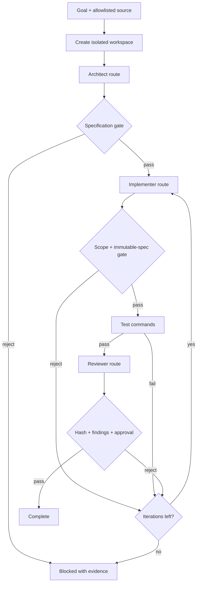

# Architecture

## Design principle

The platform separates intent, execution, evidence, and alerting. Hermes coordinates work; deterministic programs perform bounded actions; systemd owns processes; JSON and SQLite record results; watchdogs evaluate evidence; Telegram is an operator channel, not the source of truth.

## Layers

### 1. Operator plane

The operator uses Telegram for commands and alerts, and SSH tunnels for private dashboards. No production web control surface is exposed directly to the internet.

### 2. Hermes control plane

Hermes Agent runs as a systemd user service. Its internal scheduler launches named jobs with explicit cron expressions and records every claim, start, finish, status, and error in an execution database. Jobs call small shell wrappers rather than embedding business logic in the scheduler.

### 3. Service plane

Long-running components are systemd user services:

- Hermes Gateway;
- OmniRoute in a health-checked container;
- Global Builder Radar private panel;
- isolated Wellfound and InfoJobs browser stacks;
- an on-demand LinkedIn browser controlled by the scheduler.

The browsers do not share profiles or debugging ports. That prevents one workload from corrupting another workload's authenticated state.

### 4. Automation plane

Each workflow has a narrow responsibility and an independent authorization boundary. Discovery, save, apply, cleanup, and reporting are different commands. Destructive or externally visible actions use explicit confirmation flags and bounded daily limits.

### 5. Evidence plane

Workflows produce machine-readable evidence. JSON files capture run-level counters and stop reasons. SQLite ledgers track durable decisions. Reports include short SHA-256 fingerprints so an operator can confirm which evidence was summarized.

### 6. Health plane

Watchdogs are quiet on success. They check service state, CDP reachability, memory, disk, timer state, report freshness, scheduler result, and SQLite integrity. Duplicate alerts are suppressed using a hash of the current failure state.

### 7. AI routing and builder plane

OmniRoute exposes a loopback OpenAI-compatible endpoint and owns model routing/fallbacks. The builder invokes three logical routes—architect, implementer, reviewer—but the deterministic controller owns the state machine. Role outputs are constrained by file-level gates and cannot bypass tests or review.

## Network boundaries

| Service | Binding pattern | Access pattern |
|---|---|---|
| OmniRoute | `127.0.0.1` | Local clients or SSH tunnel |
| Private dashboard | `127.0.0.1` | SSH tunnel |
| CDP endpoints | `127.0.0.1` | Local automation only |
| noVNC | `127.0.0.1` | Temporary operator tunnel |
| Telegram | Outbound integration | Hermes Gateway |

Production port numbers, addresses, tokens, and account identifiers are intentionally absent from this public repository.

## Builder state machine

The workspace path, source path, configured profile, model route, tool policy, and output hashes are all controller inputs. A model response is evidence to evaluate, never authority to change state.
